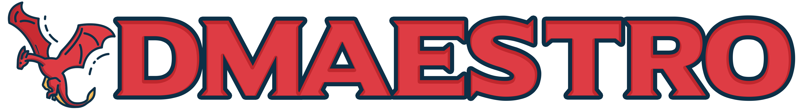
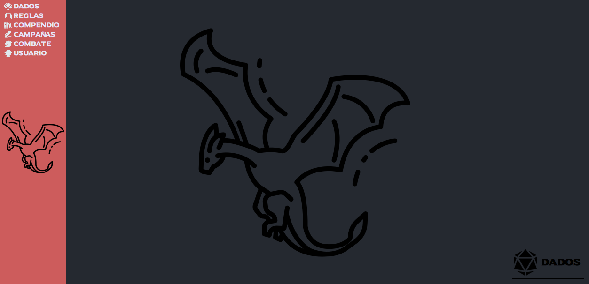
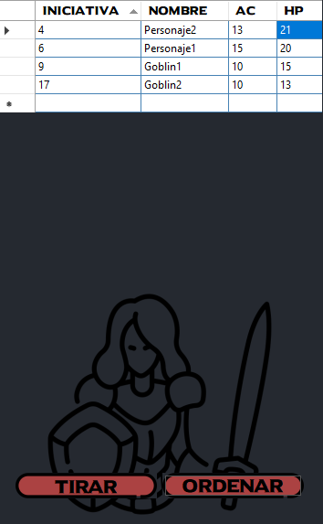
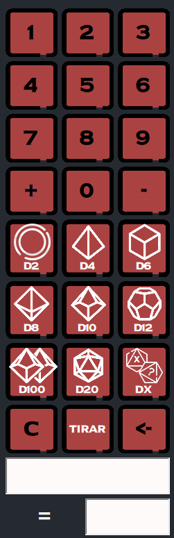
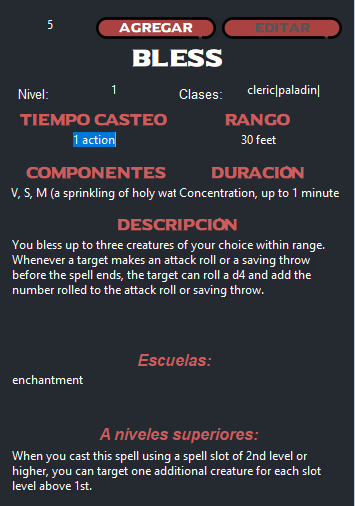
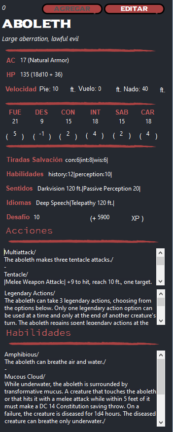

<h1 align="center">
  
</h1>

  DMAESTRO
   
 
   
  

 

Tabla de Contenidos/Table of Contents

- [Sobre/About](#sobre--about)
  - [Capturas de Pantalla/Screenshots](#capturas-de-pantalla--screenshots)
  - [Hecho con/Built With](#hecho-con--built-with)
- [Empezando/Getting Started](#empezando--getting-started)
  - [Requisitos previos/Prerequisites](#requisitos-previos--prerequisites)
  - [Instalación/Installation](#instalaci%C3%B3n--installation)
- [Utilización/Usage](#utilizaci%C3%B3n--usage)
- [Licencia/License](#licencia--license)
- [Reconocimientos/Acknowledgements](#reconocimientos--acknowledgments)

---

## Sobre / About

> Este proyecto es una herramiento digital para dungeon masters. 

> This project is a digital tool for Dungeon Masters.
> 

---
## Capturas de Pantalla / Screenshots
 

|                        Menu Principal/Main Menu                       |                         Iniciativa/Initiative                           |
| :-------------------------------------------------------------------: | :--------------------------------------------------------------------: |
|   |   |
|                           Calculadora Dados/Dice Calculator            |                         Cartas de Hechizos/Spell Cards                         |
|  |  |
|     |   |
|                        Bloque Stats/Stat Block                          |                                               |
| | |
| | 

### Hecho con / Built With

> Hecho en C# con la biblioteca de Windows Forms. 

> Made in C# with Windows Forms library.

## Empezando / Getting Started

### Requisitos previos / Prerequisites

> Es necesario tener instalado C# y Visual Studio Community para poder ejecutar. 

> It is necessary to have C# and Visual Studio Community installed to be able to run the program.

### Instalación / Installation

> Puede instalar Python utilizando el siguiente enlace: https://visualstudio.microsoft.com/es/free-developer-offers/?authuser=0 . 
> 
> El repositorio se puede descargar desde <>Code -> Download ZIP. 

> To install Python use the following link: https://visualstudio.microsoft.com/es/free-developer-offers/?authuser=0 . 
> 
> The repository can be downloaded from <>Code -> Download ZIP.

|                        Descarga/Download                       |                        Descarga/Download                                |
| :-------------------------------------------------------------------: | :--------------------------------------------------------------------: |
|   |   |
|                           Instalacion Python/Python Install       |                         Instalacion Pygame/Pygame Install                           |
|  |  |
|     |   |
|                              Repositorio/Repository           |                 Carpetas/Folders                            |
| | |
| |   |

## Utilización / Usage

> El código se puede utilizar como gusten y de forma libre, ya sea como base para otro código o con el fin de aportar a este mismo (como contribuir se explica más adelante).

> The code can be used as you like, freely, either as a base for another code or to contribute to this one (how to contribute next).

## Contribuciones / Contributing

Si desean contribuir por favor lea las [pautas de contribución](docs/CONTRIBUTING.md).Desde ya cualquier tipo de contribución es **muy apreciada**.

If you would like to contribute please read the [contribution guidelines](docs/CONTRIBUTING.md). Any tyoe of contribution is **greatly appreciated**.

## Autores y contribuyentes / Authors & contributors

El setup original del repositorio fue hecho por [Jonathan De Castro](https://github.com/jonybhm). 

Lista de [Contribuyentes](https://github.com/jonybhm/Shade_knight/contributors). 

The original setup of this repository is by [Jonathan De Castro](https://github.com/jonybhm).

List of [Contributors](https://github.com/jonybhm/Shade_knight/contributors).

## Licencia / License

Este proyecto está autorizado bajo la **Licencia Pública General de GNU V3.0**.

Consulte [LICENCIA](LICENSE) para obtener más información.

This project is licensed under the **GNU General Public License V3.0**.

See [LICENSE](LICENSE) for more information.

## Reconocimientos / Acknowledgments

> “This is unofficial Fan Content permitted under the Fan Content Policy. Not approved/endorsed by Wizards. Portions of the materials used are property of Wizards of the Coast. ©Wizards of the Coast LLC.”
